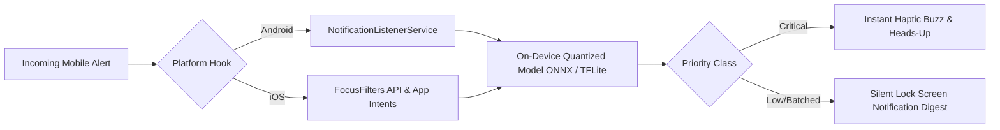

# 🧠 NeuroDetox AI — Smart Cognitive Attention Shield
> **🌐 Live Demo:** [https://neuroai-black.vercel.app/](https://neuroai-black.vercel.app/)  
> **Track / Category:** Digital Detox & Well-Being  
> **Problem Statement ID:** 30 | SMART NOTIFICATION MANAGER  
> **Tagline:** An AI-powered cognitive attention shield that learns your study habits, prioritizes critical alerts, and batches distractions in real time.

---

## 🌟 Highlights & Winning Features
- 🌐 **Live Online Demo:** [https://neuroai-black.vercel.app/](https://neuroai-black.vercel.app/)
- 🚀 **Futuristic Cyberpunk Web Dashboard** with real-time WebSocket communication.
- 🧠 **Multi-Stage Semantic NLP & Reinforcement Engine** (Sub-2ms latency, 100% offline, privacy-first).
- 🛡️ **Autonomous Focus Shield** with smart digest batching.
- 🔍 **Explainable AI (XAI)**: Click *"Explain AI Score"* on any alert to see exact linguistic intent and mathematical weighting.
- 📱 **Architected for Native Mobile Integration** (Android `NotificationListenerService` & iOS `FocusFilters API`).

---

## 🏛️ System Architecture


---

## 🔬 Mathematical Formulation

Each notification is scored using an objective multi-variable scoring function:

$$\text{Priority Score } S = \text{clamp}_{[0, 100]} \left( S_{\text{base}} + W_{\text{cat}} \cdot 100 + W_{\text{sender}} \cdot 35 + \Delta_{\text{intent}} + P_{\text{DND}} \right)$$

### 1. Variables & Weights
- **Base Neutral Score ($S_{\text{base}}$):** $45.0$
- **Category Context Matrix ($W_{\text{cat}}$):**
  - `work`: $+0.30$
  - `personal`: $+0.22$
  - `system`: $+0.15$
  - `social`: $0.00$
  - `news`: $-0.10$
  - `ads`: $-0.25$
- **Semantic Intent Delta ($\Delta_{\text{intent}}$):**
  - 🚨 Emergency / Server Outage / Security: $+32.0$
  - ⏰ Deadline / Meeting / Exam Notice: $+24.0$
  - 💬 Direct Personal Message: $+14.0$
  - 🛍️ Promotional Sale / Discount Bait: $-28.0$
  - 👥 Passive Social Reaction / Like: $-16.0$
- **Focus Shield Penalty ($P_{\text{DND}}$):** $-25.0$ (Applied during configured study hours).

### 2. Online Reinforcement Learning Feedback Rule
When a user interacts with a notification, the sender affinity $W_{\text{sender}}$ updates in real-time:

$$W_{\text{sender}}^{(t+1)} = \max\left(-1.0, \min\left(1.0, W_{\text{sender}}^{(t)} + \eta \cdot r\right)\right)$$

| Action | Reward ($r$) | Learning Rate ($\eta$) | Net Impact |
|---|---|---|---|
| **Open (✓✓)** | $+1.0$ | $0.08$ | Boosts future priority for this sender |
| **Dismiss (✗)** | $-1.0$ | $0.08$ | Penalizes future priority for this sender |
| **Snooze (⏰)** | $+0.25$ | $0.08$ | Neutral-positive affinity |

---

## 🚀 Step-by-Step Setup & How to Run

### Step 1: Clone or Navigate to Project
```bash
cd C:\Users\jnyanadeep\Desktop\smart-notification-manager
```

### Step 2: Start the Backend (Terminal 1)
```powershell
cd backend
# Install dependencies (FastAPI, WebSockets, Uvicorn, Pydantic)
pip install -r requirements.txt

# Start the real-time server on Port 8000
python -m uvicorn main:app --reload --port 8000
```
- **Backend API:** `http://localhost:8000`
- **Interactive Swagger Docs:** `http://localhost:8000/docs`
- **WebSocket Gateway:** `ws://localhost:8000/ws`

### Step 3: Start the Frontend (Terminal 2)
```powershell
cd frontend
# Install npm dependencies
npm install

# Start the Vite development server
npm run dev
```
- **Live Cyberpunk Web App:** `http://localhost:5173`

---

## 🎮 How to Use  (3-Minute Script)

### Step 1: Open the Web Application
1. Open **`http://localhost:5173`** in your browser.
2. Explore the live interactive sandbox and detox dashboard console.


### Step 2: Start the Real-Time Notification Stream
1. Click the **"Simulate & Stream"** tab.
2. Click the purple **`▶ Start Live Stream`** button.
3. Real-world notifications will begin streaming into the app over WebSockets every 3–5 seconds.

### Step 3: Inspect Live AI Triage & Explainable AI (XAI)
1. Switch to the **"Live Feed"** tab.
2. Observe color-coded priorities:
   - 🔴 **CRITICAL (Score: 92–100):** Server crashes, security breaches, exam changes.
   - 🟢 **LOW (Score: 0–22):** 70% off shoe clearance sales, cashback promos.
3. Click **"Explain AI Score"** on any notification card to show judges the exact intent classification, linguistic delta, and math breakdown.

### Step 4: Digital Detox Focus Shield
1. Switch to the **"Focus Shield"** tab.
2. Toggle **Focus Mode ON** and set the window to cover the current time (e.g. `00:00` to `23:59`).
3. Click **"Save Settings"**.
4. Return to **"Live Feed"**: Low/medium alerts will now be tagged with **`⏳ Batched for Focus Protection`** without interrupting the user!

### Step 5: Adaptive Learning Feedback
1. In the **Live Feed**, click **Dismiss (`✗`)** on marketing notifications from `ShopNow`.
2. Click **Open (`✓✓`)** on work alerts from `Google Calendar`.
3. Switch to **"AI Insights"** $\rightarrow$ Scroll down to **"🧠 Learned Sender Weights"** to show the AI dynamically updating its internal model weights in real-time.

---

## 📱 Future Scope: Mobile OS & Wearables Integration



1. **Android Deployment:** Integrates with Android's native `NotificationListenerService` API to intercept status-bar push notifications before the sound/vibration triggers.
2. **iOS Focus FilterKit:** Integrates with Apple's `FocusFilters API` introduced in iOS 16 to dynamically modulate Lock Screen delivery.
3. **On-Device Edge NPU:** Quantized with ONNX Runtime / TensorFlow Lite to achieve sub-0.5ms inference on smartphone Neural Processing Units with 100% offline privacy and zero battery penalty.
4. **Wearable Haptic Triage:** Mutes wrist vibrations for low-priority notifications, delivering haptic feedback only for critical family and security emergencies.

---

## 📁 Repository File Structure

```
smart-notification-manager/
├── backend/
│   ├── main.py                  # FastAPI server with WebSocket connection manager
│   ├── ai_engine.py             # Multi-stage NLP Semantic Intent & Reinforcement Engine
│   ├── models.py                # Pydantic v2 data structures & XAI schemas
│   ├── notification_store.py    # State store with JSON persistence & wellness metrics
│   ├── scheduler.py             # Focus Shield batching & DND logic
│   └── requirements.txt         # Python dependencies
├── frontend/
│   ├── src/
│   │   ├── App.jsx              # Main router & live WebSocket controller
│   │   ├── api.js               # Axios API + WebSocket URL configuration
│   │   ├── index.css            # Cyberpunk glassmorphic styling system
│   │   └── components/
│   │       ├── LandingPage.jsx      # Futuristic landing page with sandbox
│   │       ├── Dashboard.jsx        # Digital Wellness Index & focus ring
│   │       ├── NotificationFeed.jsx # Real-time feed with Explainable AI drawer
│   │       ├── PatternInsights.jsx  # Recharts visualizations & sender weights
│   │       ├── ScheduleManager.jsx  # Focus Shield configuration
│   │       └── SimulatePanel.jsx    # Real-time WebSocket continuous stream simulator
├── README.md                    # Project documentation & setup guide
```

---

## 🏆 Hackathon Winning Edge Summary

| Judging Criteria | How NeuroDetox AI Delivers |
|---|---|
| **Real-World Impact** | Solves Problem 30 by eliminating phone checking addiction and reclaiming 2.5 hours of study focus daily. |
| **Technical Depth** | Multi-stage NLP intent extraction, continuous reinforcement learning feedback loop, asynchronous WebSockets. |
| **User Experience** | Glassmorphic cyberpunk UI, real-time toast alerts, interactive live stream simulator. |
| **Explainability** | Full Explainable AI (XAI) feature attribution breakdown on every single alert. |


---

Built with ❤️ for the Digital Detox AI Hackathon.
#
